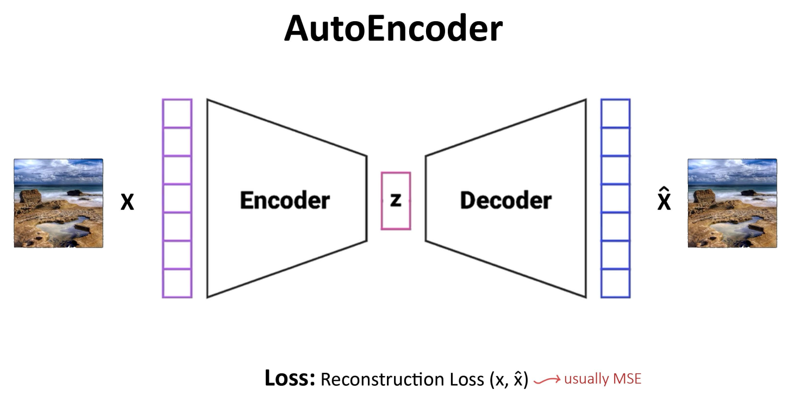
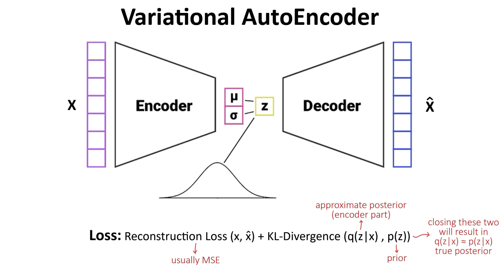
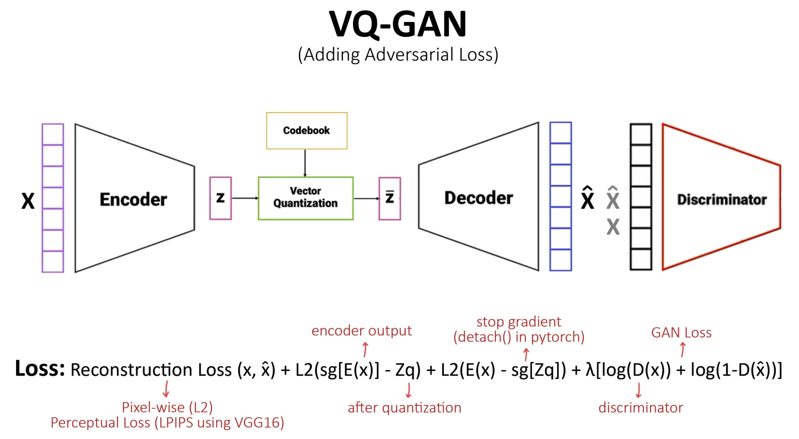
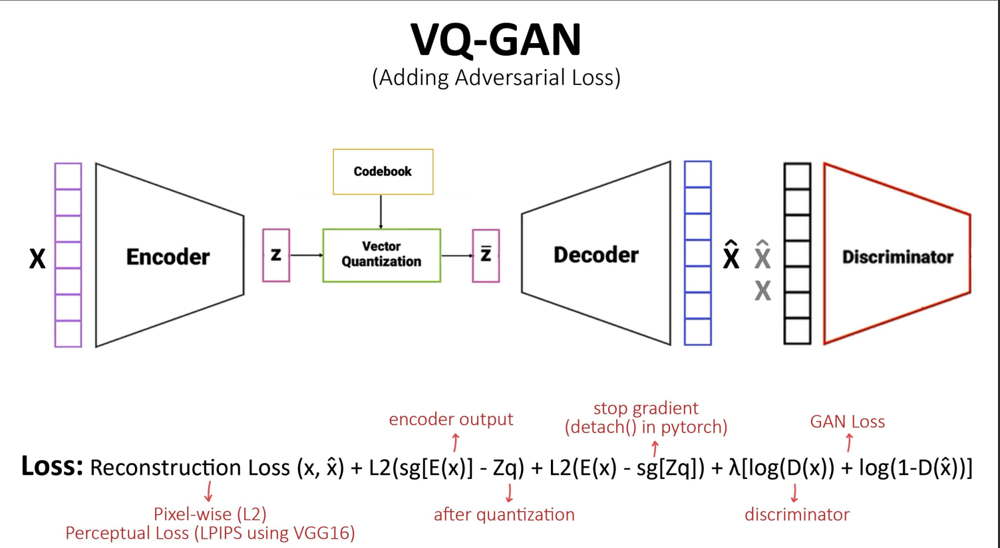

# Anime-Image-Synthesis
Generatibg high quality anime images using advanced Advesarial neural networks (VQGAN).

# Vector-Quantized-Generative-Adversarial-Networks-

Train VQGAN on your own data: 
Training First Stage

    1.Set path to dataset in training_vqgan.py
    2.python training_vqgan.py

Training Second Stage

    1.Set path to dataset in training_transformer.py
    2.python training_transformer.py

# Vector Quantized Generative Adversial Networks(VQGAN)  =  Variational AutoEncoder(VAE) + Generative Adaversarial Networks (GAN) 

1. AutoEncoder:

     

    # Problems in AE
    1) Similar images are not similar in latent space(vice versa)
    2) Latent points can widely spread (no supervision)
                          

2. Variational AutoEncoder:

   

   # Why VAE?

   Reparametrize latent space:  make it continuous and center it around the origin

3. Vector Quantized Variational AutoEncoder:

   

   # Why VQ-VAE?

   Applying some sort of clustering in latent space: Easier reconstruction(focus on less playful inputs) and More control over generation

 4. Vector Quantized Generative Adversial Network:

    

    # Why VQ-GAN?

    Better results (Adversarial loss make the results less blurry)
